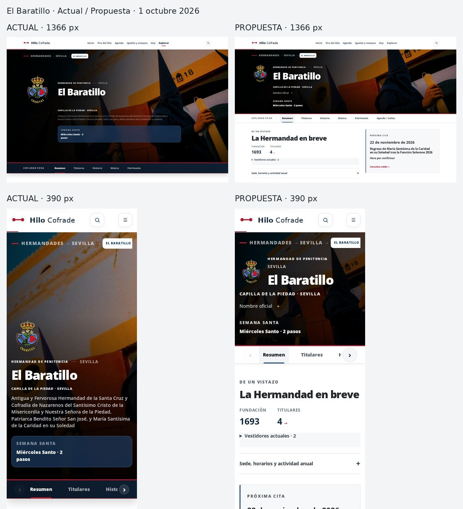

# Laboratorio de lectura de Hermandades · 1/10/2026

## Preflight verificado

- main y producción: `a993ca20e4402cdfcdede1ec7e94be043bcc299f`.
- Producción Vercel: `dpl_Dq6rTjTVKMWhjDDvQFxJu3hTdpLZ`, READY.
- Supabase: ACTIVE_HEALTHY. Sin escrituras, migraciones ni cambios de permisos.
- Últimos merges: #1049 (recorridos), #1048 (repertorios), #1047 (primer plegado), #1046 (editorial).
- PR abiertas: #1050 buscador; #1020 rendimiento de portada; #1019 Pastora de Marchena aparcada.
- #1019 comparte `app/hermandades/[slug]/page.js`. El laboratorio parte de main actual; no integra, cierra ni cambia esa PR. Antes de una futura integración, reconciliar su ajuste de enlace histórico de Banda.

## Diagnóstico

Inspección pública real a 1363 × 936: hero 699 px, Titulares a 2658 px, Historia a 8445 px, total 16412 px. Dos módulos Tira del hilo comparten ID; un módulo de descubrimiento adicional precede a Música. Sede y horarios abiertos pesan 1314 px; Pasos abiertos 1581 px. La cronología y Conoce ya estaban plegados: no se rehace el frente editorial cerrado.

## Arquitectura propuesta

1. Cabecera compacta con foto y escudo gobernados; nombre oficial desplegable.
2. Menú de seis áreas como máximo.
3. Síntesis + próxima cita en dos columnas si existen datos.
4. Conoce: resumen y claves disponibles en SSR.
5. Titulares y Pasos, con datos técnicos de Paso plegados.
6. Historia: cinco hitos con criterios temáticos, cronología íntegra.
7. Música: actual, propia, composiciones, crucetas e histórico agrupados.
8. Patrimonio: piezas, intervenciones y documentos asociados.
9. Agenda y cultos: próxima cita y archivo de ediciones.
10. Una única sección de conexiones, cuatro relaciones iniciales y todas las restantes; rutas de segundo grado plegadas.
11. Enlaces y fuentes documentales.

Fondos blancos y grises neutros. Colores de entidad en líneas y detalles, sin mezclar automáticamente el secundario en grandes superficies.

## Aislamiento

Ruta genérica `/laboratorio/hermandades/[slug]`, disponible en desarrollo y preview, 404 en producción. No contiene condición por slug. Las rutas públicas conservan su diseño. Esta puerta permite validar El Baratillo antes de decidir una activación: fusionar el laboratorio por sí solo NO activa el rediseño público.

El laboratorio usa canonical de la ficha pública, `noindex, follow` para impedir una segunda URL indexada; la ficha pública conserva su metadata, schema y robots. Contenido de detalles renderizado íntegramente en servidor. Sin bibliotecas nuevas ni dependencias de producto.

## Reconciliación y preview final

Durante el trabajo main avanzó a `3c75b4432f081f99495fffa09b896ef280ac95dc`, incorporando #1050–#1054. Reconciliados buscador, Autores y recorridos; se preservó la documentación de Autores al resolver el único conflicto. #1019 y #1020 siguen fuera del laboratorio.

Código verificado: `eb54bfa244a063b2244bcc77aeffdc77f390c2d8`.
Vercel `dpl_AFDm3UNxzy8XiTL3VtCDbV2TTNWf`, READY.
Preview: https://base-cofrade-ayua31bjp-desdeel-arenal.vercel.app/laboratorio/hermandades/el-baratillo (protegida; enlace temporal de acceso entregado a Nacho).
PR draft: https://github.com/nachosanchezperez-ux/base-cofrade/pull/1055

## Antes / después

Mediciones aproximadas en px con viewport de 900 px de alto. Scroll hasta sección medido desde el inicio del documento; total con los archivos cerrados. El catálogo patrimonial conserva una pieza visible. No se cuentan como abiertos los contenidos SSR dentro de details cerrados.

| Ancho | Hero actual → propuesta | Titulares actual → propuesta | Historia actual → propuesta | Total actual → propuesta |
|---:|---:|---:|---:|---:|
| 390 | 764 → 341 | 3029 → 1538 | 14888 → 4962 | 26223 → 11069 |
| 430 | 751 → 345 | 2989 → 1548 | 14286 → 4795 | 24925 → 10732 |
| 768 | 704 → 398 | 2501 → 1297 | 11048 → 3307 | 19837 → 8825 |
| 1024 | 644 → 398 | 2548 → 1281 | 8460 → 3135 | 16893 → 7669 |
| 1366 | 701 → 398 | 2660 → 1281 | 8464 → 3021 | 16432 → 7507 |
| 1600 | 764 → 398 | 2729 → 1281 | 8533 → 3021 | 16504 → 7507 |

Menú: 5 → 6 áreas. Details abiertos por defecto: 1 → 1; se ha reducido la cantidad de módulos visibles completos, no ese contador. Total: −57,8 % a 390; −54,3 % a 1366. IDs duplicados: 1 → 0. Desbordamiento horizontal: 6 → 0 px a 390/430; 0 en los otros cuatro anchos de propuesta.

## QA visual y funcional · PASS del piloto

- 390, 430, 768, 1024, 1366 y 1600: revisión de cabecera, síntesis, Conoce, Titulares, Pasos, Historia, Música, Patrimonio, Agenda, conexiones, fuentes y pie. Menú horizontal y sticky visibles; sin cortes de contenido ni desbordamiento de página. La opción parcialmente visible al borde del menú indica que hay más opciones y se completa mediante desplazamiento o flecha.
- Historia: enlace con aria-current correcto; cronología abre y conserva 15 hitos en los seis anchos. Cinco destacados semánticos: 1693, 1905, 1945, 1993 y 2024.
- Próxima cita: regreso de la Caridad del 22/11/2026. Hora sin dato confirmable: «Hora por confirmar». Enlace nativo abre los details ancestros y llega al archivo; comprobado en los seis anchos y en navegador remoto real. No se inventan recorrido o música cuando la cita no los proporciona.
- Conexiones: una sección, cuatro relaciones iniciales diversas (Imagen, Paso, Banda, Marcha), resto accesible; rutas secundarias plegadas. Fuente, enlaces y archivo permanecen.
- Teclado: Enter abre/cierra Fuentes; foco visible de 3 px; ArrowRight desde Resumen mueve el foco a Titulares. Summary nativos conservan su semántica.
- Imágenes: gobernadas, créditos preservados y compactados; cero imágenes rotas detectadas. Blanco y gris neutro verificados en Música y conexiones. Velo móvil reforzado para lectura.
- Consola de página: cero pageerror. HTTP 200 en actual y propuesta. Build PASS y 1436/1436 tests PASS tras reconciliación.

Método: navegador remoto de producción y preview a 1363 × 936, más Chromium 153/Playwright en los seis viewports. Por las restricciones de red del navegador de pruebas, HTML, CSS, JS, fuentes e imágenes de las URLs HTTPS se obtuvieron con fetch Node y se entregaron sin modificación de cuerpos al navegador mediante interceptación de requests; se mantuvo hidratación y se ejecutaron clics, scroll y teclado. No se desactivó validación TLS. Son viewports de navegador, no ensayos en dispositivos físicos. Evidencia numérica: [actual](./qa/hermandad-lectura-2026-10-01/matrix-current.json), [propuesta](./qa/hermandad-lectura-2026-10-01/matrix-proposal.json), [teclado](./qa/hermandad-lectura-2026-10-01/matrix-extra.json).

## SEO y conservación de conocimiento

SSR sin carga diferida del texto: 15 hitos, 39 composiciones y 18 fuentes siguen en el HTML; detalles completos presentes aunque plegados. Comparación del HTML real: ninguno de los enlaces no fragmentarios de main desaparece. De 52 párrafos originales de más de 80 caracteres solo se elimina el texto introductorio del bloque relacional duplicado («Tira del hilo hacia sus imágenes…»), sin información documental de la entidad.

H1 único. Title y description preservados; canonical `https://hilocofrade.es/hermandades/el-baratillo`. JSON-LD parseable con Organization, WebSite, BreadcrumbList y WebPage; se conserva la organización del sitio y la de la Hermandad. Subáreas musicales usan H3 bajo Música. Producción pública mantiene `index, follow`; preview usa intencionalmente `noindex, follow`. No se cambia sitemap ni se solicita reindexación de una URL de laboratorio.

## Rendimiento y límites

Sin nuevas dependencias de producto, librerías visuales ni animaciones complejas. Composición y textos mayoritariamente server; se reutiliza el componente client de navegación para revelar ancestros cerrados y desplazar solo su carril horizontal. La ficha pública conserva sus valores por defecto. No se observan regresiones funcionales de render o hidratación. Este QA no constituye una certificación Lighthouse ni de Core Web Vitals.

El PASS se limita a El Baratillo y a la matriz descrita. Antes de una extensión general deben revisarse otros perfiles (sin fotografía, Gloria, Sacramental, pocos datos y catálogos largos) y reconciliar el ajuste histórico de Banda de #1019 si se integra posteriormente. No hay activación por slug ni despliegue público de este diseño.

## Puerta

NO PRODUCCIÓN. Requiere evaluación de preview y autorización expresa posterior para activación pública.
